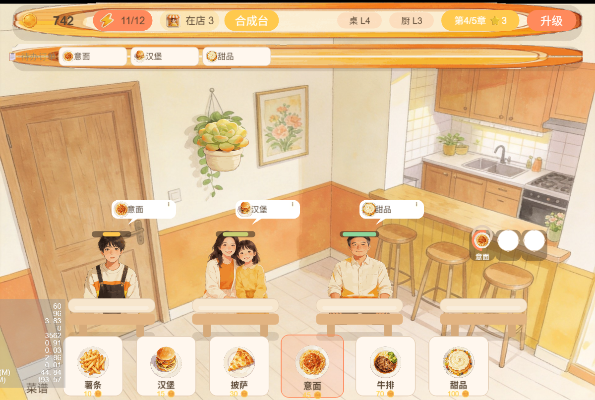

# 暖柒餐厅 Romantic Restaurant 🍳


> 🤖 **本项目由 GLM-5.3-Flash（牛来）模型在一个周末内开发完成**——包括全部代码、AI 水彩美术、玩法系统与五章剧情；人类只负责提需求、试玩和验收。
> 复刻对象是最近爆火的柠檬微趣《浪漫餐厅》（Gossip Harbor）。

一款水彩画风的餐厅经营 + 合成研发小游戏，**Cocos Creator 3.8 + TypeScript** 开发。
你扮演离婚后带着女儿重新开始的小柒，把一家濒临倒闭的小店经营成想要的样子。

## 🎮 在线试玩

**[点击这里直接在浏览器中游玩](https://htwmedia.github.io/romantic-restaurant/play/)**（无需安装，建议桌面端 Chrome/Edge）



## ✨ 玩法特色

- **餐厅经营**：顾客上门点单 → 菜谱做菜 → 厨房多槽位并行烹饪 → 上菜收款；连击倍率、满意度衰减、体力闸口 + 激励广告回满
- **合成研发台**：金币购买素材、免费生成器，两两合成升阶，四条研发链最终解锁新菜；成品可出售回血
- **研发链路卡**：点击顾客订单即可查看这道菜"从素材到成品"的完整合成路径（致敬《浪漫餐厅》的同款设计）
- **五章主线剧情**：数据驱动的章节目标 + 通关奖励 + 角色对话；合成解锁新菜时自动触发剧情反应
- **装修系统**：五套水彩装修，各自带真实经营加成（顾客耐心 / 收入 / 烹饪速度）
- **升级系统**：桌位、厨房多级成长，升级前可预览下一级奖励

## 🛠 技术要点

- Cocos Creator **3.8.8**，全部 UI 由代码即时构建（Graphics / Label），无预制体依赖
- 数据驱动：章节、装修、合成链、美术清单均为 TS 数据表，加内容不改逻辑
- 核心逻辑与视图分离，**40 个单元测试**（vitest）覆盖数据层
- 平台适配层：存储与激励广告已抽象，浏览器 / 微信小游戏按环境自动切换（[core/platform.ts](assets/scripts/core/platform.ts)）
- 配套工具脚本：美术透明度校验、批量压缩、合成图生成（[tools/](tools/)）
- 开发过程笔记（四层设计拆解）见 [docs/README-dev-notes.md](docs/README-dev-notes.md)

## 🚀 本地运行

1. 用 **Cocos Creator 3.8.8** 打开本仓库根目录；
2. 打开 `assets/scenes/main.scene`，点击预览即可；
3. 运行测试：`npm install && npm test`。

## 📦 更新在线试玩

两种方式任选：

- **本地一键发布**：`powershell -File tools/release-play.ps1`（构建 → 拷贝 → 推送一条龙，需本机装有 Cocos Creator）；
- **CI 自动构建**：在 GitHub 上手动触发 `Deploy Play` workflow（首次需在仓库 Variables 配置 `COCOS_CREATOR_ZIP_URL` 编辑器直链，见 workflow 文件注释）。修改 `assets/` 后推送到 main 也会自动触发。

## 📁 目录结构

```
assets/
  resources/art/    # 全部美术资源（AI 生成，见 docs/ai-art-prompts.md）
  scripts/core/     # 数据层：章节、装修、合成链、存档、平台适配
  scripts/ui/       # 视图层：餐厅、厨房、合成台、升级、装修、对话等
  scenes/           # 场景
tests/              # vitest 单元测试
tools/              # 出图管线脚本（透明度校验 / 压缩 / 占位图）
docs/               # 文档与 Web 构建产物（GitHub Pages）
```

## 📜 协议

- 代码：[MIT](LICENSE-MIT)
- 美术资源：[CC BY 4.0](LICENSE-ASSETS)（AI 生成，署名即可自由使用与商用）

## 🤖 关于"一个周末"

- **AI（牛来 / GLM-5.3-Flash）**：全部游戏代码、UI 布局、数值设计、水彩美术的生成与修复、剧情文案、CI/发布脚本、本 README；
- **人类**：一句话需求（"做个仿《浪漫餐厅》的"）、试玩验收、以及偶尔"这个不好看/不合理"的迭代反馈；
- **过程**：周五晚开工 → 周日上线，中途踩坑包括 AI 出图的假透明背景、Cocos 9-slice 坑、热更新缓存导致的"半新半旧"构建等，修复脚本都留在 [tools/](tools/)；
- **免责声明**：玩法致敬《Gossip Harbor》，本项目与其官方无任何关联；代码与素材请遵守文末协议。

## 🙏 致谢

玩法灵感来自 [Gossip Harbor（浪漫餐厅）](https://www.taptap.cn/app/472491)；美术资源由 AI 水彩风格生成；由 [GLM-5.3-Flash](https://open.bigmodel.cn/)（牛来）驱动开发。
